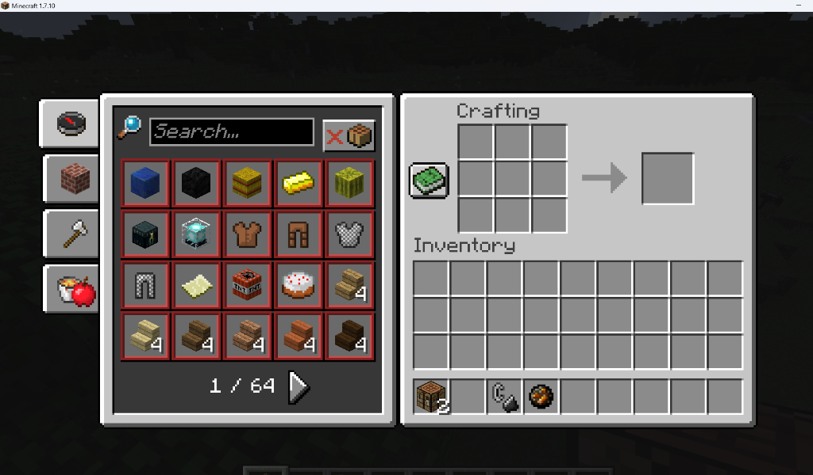
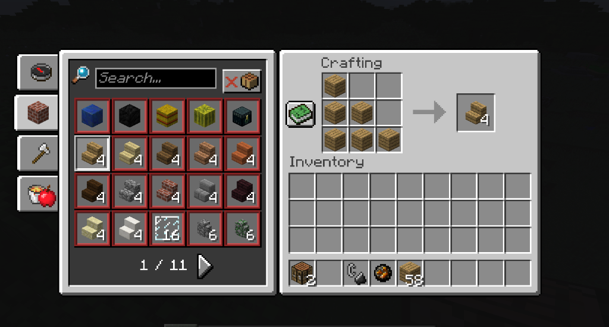
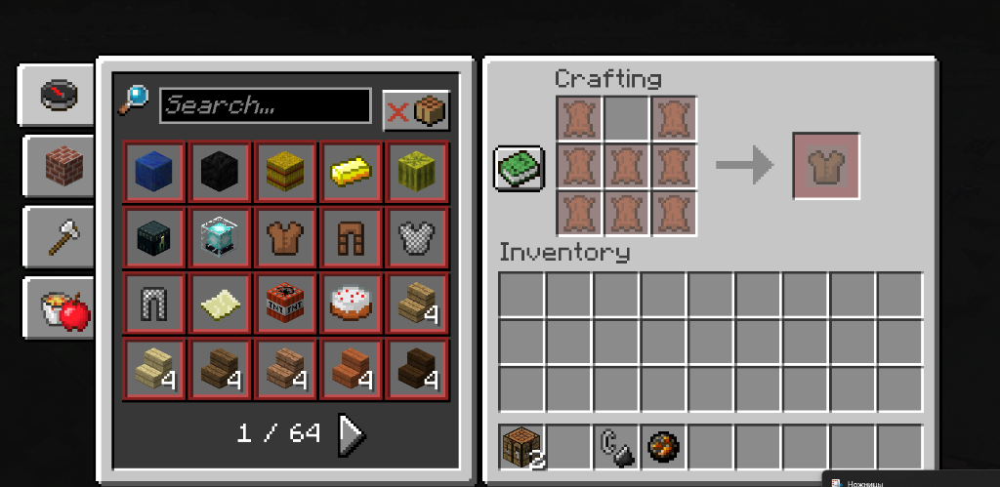

# NewerInv

A client-side backport of the modern Minecraft (1.12+) Recipe Book interface for Minecraft 1.7.10 (Forge).

Works on both singleplayer and multiplayer servers without needing server-side installation.



---

## Features

- **Faithful 1.12+ UI Layout**: Seamlessly docks to the survival inventory (2x2) and crafting table (3x3), properly centering the combined window on screen.
- **Search Bar**: Live search with active focus border and quick right-click clearing.
- **Category Tabs**: Filter by All/Search, Building Blocks, Equipment/Tools, and Miscellaneous items.
- **Craftable Filter**: Toggle between showing all known recipes or only those craftable with current inventory items.

### Smart Auto-Fill
- Left-click a recipe to place one craft into the grid.
- Right-click / Shift-click to place materials for maximum possible crafts.
- Click the output item to craft.



### Ghost Recipes (Crafting Hints)
- Clicking a recipe you lack ingredients for displays a translucent ghost preview in the crafting grid.
- Missing ingredients and the result slot are highlighted in semi-transparent red.
- Hovering over ghost items displays standard item tooltips.
- Clicking any slot or typing dismisses the hint.



### Safe Inventory Handling
- Automatically shifts existing grid items back to your inventory before placing a recipe.
- If your inventory is completely full, leftover items safely drop onto the ground at your feet.

---

## Installation

1. Install **Minecraft Forge 1.7.10** (build 1614 or newer recommended).
2. Download `NewerInv-1.0.3.jar` from Releases.
3. Drop the `.jar` into your `.minecraft/mods` folder.
4. Launch the game.

*Note: This mod is strictly client-side. It does not need to be installed on servers.*

---

## Building from Source

Requires **JDK 8** (or Java 21 with RetroFuturaGradle).

```bash
git clone https://github.com/yourusername/NewerInv.git
cd NewerInv
./gradlew build
```

The compiled mod jar will be in `build/libs/`.

---

## License & Disclaimer

- The source code of this mod is licensed under the [MIT License](LICENSE).
- **Disclaimer**: *NewerInv is an unofficial fan project and is not affiliated with, endorsed by, or associated with Mojang Studios or Microsoft. Minecraft and related assets are property of Mojang Studios / Microsoft.*
